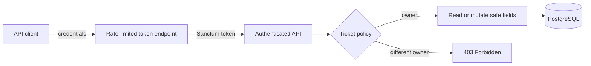

# Laravel API Hardening Lab

[](https://github.com/viniciusmarquesvaz/laravel-api-hardening-lab/actions/workflows/ci.yml)

[](LICENSE)

A small defensive-security case study showing how to harden a Laravel API with explicit authorization, safe input handling, token authentication, bounded login attempts, PostgreSQL, Docker, and regression tests.

The scenario and data are entirely synthetic. The repository is an engineering reference, not a production-ready ticketing product.

## Security boundary



## What this project proves

| Risk | Root cause | Control | Regression evidence |
| --- | --- | --- | --- |
| IDOR / broken object authorization | Loading a record without checking its owner | `TicketPolicy` plus owner-scoped listing | Cross-user requests return `403`; lists contain only owned records |
| Mass assignment | Trusting ownership or workflow fields from the request | Form Requests, validated payloads, and relationship-based creation | `user_id` and `status` cannot be overwritten |
| Credential enumeration | Returning different errors for unknown users and bad passwords | One uniform credential error | Both cases return the same response |
| Brute-force attempts | Unbounded token creation attempts | Email-and-IP rate limiter | The sixth attempt returns `429` |
| Secret or payload exposure | Debug output and broad serialization | `APP_DEBUG=false` and an explicit API Resource | Responses contain only the documented ticket fields |

The secure implementation lives on `main`. This project does not keep an intentionally exploitable deployment online.

## Stack

- PHP 8.4 and Laravel 13
- Laravel Sanctum
- PostgreSQL 17
- PHPUnit and Laravel HTTP tests
- Docker Compose
- OpenAPI 3.1
- GitHub Actions and Dependabot

## Quick start

Start the API and PostgreSQL:

```bash
docker compose up --build -d
docker compose exec app php artisan db:seed
```

The seed is local-only and uses Laravel's conventional synthetic factory password, `password`, for `demo@example.test`.

Create a token:

```bash
curl -X POST http://localhost:8000/api/tokens \
  -H "Accept: application/json" \
  -H "Content-Type: application/json" \
  -d '{"email":"demo@example.test","password":"password"}'
```

Use the returned token to list the authenticated user's tickets:

```bash
curl http://localhost:8000/api/tickets \
  -H "Accept: application/json" \
  -H "Authorization: Bearer YOUR_LOCAL_TOKEN"
```

Stop the stack without deleting PostgreSQL data:

```bash
docker compose down
```

## Local validation

With PHP and Composer available:

```bash
composer install
cp .env.example .env
php artisan key:generate
php artisan migrate
vendor/bin/pint --test
php artisan test
```

The CI workflow runs the same format and test gates against PostgreSQL. The API contract is in [`docs/openapi.yaml`](docs/openapi.yaml).

## Deliberate limits

Production adoption would additionally require requirements for token lifetime and rotation, email verification, audit retention, monitoring and alerting, backup policy, deployment secrets, tenant modeling, and provider-specific compliance controls. Those concerns are documented rather than guessed into this small case study.
